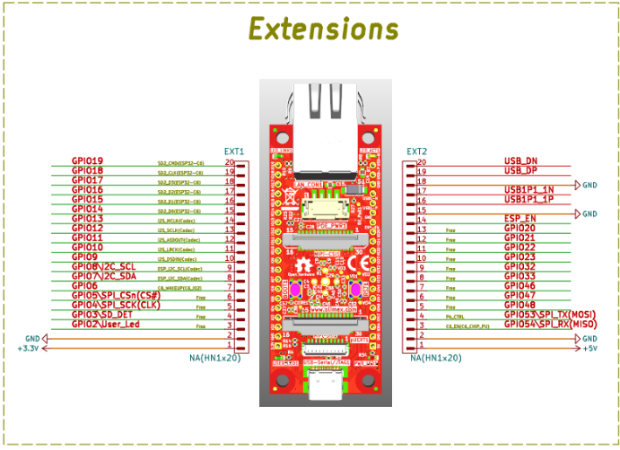

# Basic Packages

## Boards

### esphome/boards/esp32/p4_devkit_olimex.yaml



```yaml
################################################################################
# ESP32-P4-DevKit Olimex
################################################################################
# Datasheet: 
#   https://www.olimex.com/Products/IoT/ESP32-P4/ESP32-P4-DevKit/open-source-hardware
#   https://devices.esphome.io/devices/waveshare-esp32-p4-eth/
#   https://github.com/willumpie82/esphome/blob/50e9e836afc937330db95f8fc10698999480e510/esp32-p4.yaml
#   https://github.com/willumpie82/esphome/blob/dev/esp32-p4.yaml
#
# Board PinOut; 
#   https://github.com/OLIMEX/ESP32-P4-DevKit/blob/main/HARDWARE/ESP32-P4-DevKit-Rev.C/ESP32-P4-DevKit_Rev_C.pdf
#
################################################################################
# Requirement: 
#   Add the following code to substitutions & package section in the device file
# ------------------------------------------------------------------------------
# substitutions:
#   device_internal_name: 
#   device_sampling_time: 
#   uart_baud_rate: 115200
# ------------------------------------------------------------------------------
# packages:
#   board: !include 
#     file: boards/esp32/p4_devkit_olimex.yaml
#     vars:
#       i2c_scan: true
#       uart_baud_rate: 115200
#       framework_version: recommended 
# ------------------------------------------------------------------------------
# Note about Framework: https://esphome.io/components/esp32/#framework
# ------------------------------------------------------------------------------
# framework_version:
#  - dev         : Use the latest commit, note this may break at any time
#  - latest      : Use the latest release, even if it hasn’t been recommended yet.
#  - recommended : Use the recommended framework version.  
################################################################################
# Author: Svenn-Erik K. Thomsen
# Web: https://www.youtube.com/@sekt1953
# Version: 1.0.0
# Licence: CCO 1.0 https://creativecommons.org/publicdomain/zero/1.0/
# ------------------------------------------------------------------------------
# WARNING:
# ------------------------------------------------------------------------------
#   - ikke Tested OK
# ------------------------------------------------------------------------------
# This code carries a "It works on my setup" disclaimer!
# Use at your own risks!
################################################################################
esphome:
  comment: "Olimex ESP32-P4-DevKit"

esp32:
  board: esp32-p4-evboard
  variant: esp32p4
  flash_size: 16MB
  cpu_frequency: 400MHZ
  framework:
    type: esp-idf

# Status led
status_led:
  id: ${device_internal_name}_status_led
  pin:
    number: GPIO2
    inverted: false

logger:
  hardware_uart: UART0

i2c:
  - id: bus_a
    sda: GPIO7
    scl: GPIO8
    scan: true
  - id: bus_b
    sda: GPIO19
    scl: GPIO18
    scan: true

```

### esphome/boards/esp32/wroom_32d_hw_394.yaml

```yaml
################################################################################
# ESP32D-Wroom-HW-394 used USB-C
################################################################################
# Board PinOut; 
#   https://www.espboards.dev/img/S36MIHQRiM-900.png
#
################################################################################
# Requirement: 
#   Add the following code to substitutions & package section in the device file
# ------------------------------------------------------------------------------
# substitutions:
#   device_internal_name: 
#   device_sampling_time: 
#   uart_baud_rate: 115200
# ------------------------------------------------------------------------------
# packages:
#   board: !include 
#     file: boards/esp32/wroom_32d_hw_394.yaml
#     vars:
#       i2c_scan: true
#       uart_baud_rate: 115200
#       framework_version: recommended 
# ------------------------------------------------------------------------------
# Note about Framework: https://esphome.io/components/esp32/#framework
# ------------------------------------------------------------------------------
# framework_version:
#  - dev         : Use the latest commit, note this may break at any time
#  - latest      : Use the latest release, even if it hasn’t been recommended yet.
#  - recommended : Use the recommended framework version.  
################################################################################
# Author: Svenn-Erik K. Thomsen
# Web: https://www.youtube.com/@sekt1953
# Version: 1.0.0
# Licence: CCO 1.0 https://creativecommons.org/publicdomain/zero/1.0/
# ------------------------------------------------------------------------------
# WARNING:
# ------------------------------------------------------------------------------
#   - ikke Tested OK
# ------------------------------------------------------------------------------
# This code carries a "It works on my setup" disclaimer!
# Use at your own risks!
################################################################################
esp32:
  board: esp32dev
  framework:
    type: arduino
    version: ${framework_version}

# Status led
status_led:
  id: ${device_internal_name}_status_led
  pin:
    number: GPIO2
    inverted: false

# I2C settings
i2c:
  id: ${device_internal_name}_i2c_bus0
  sda: GPIO21
  scl: GPIO22
  scan: ${i2c_scan}

# UART
uart:
  id: ${device_internal_name}_uart_bus0
  tx_pin: GPIO1
  rx_pin: GPIO3
  baud_rate: ${uart_baud_rate}
  parity: NONE
  stop_bits: 1

# SPI
spi:
  id: ${device_internal_name}_spi_bus0
  clk_pin: GPIO18
  mosi_pin: GPIO23
  miso_pin: GPIO19
  interface: hardware

# Sensors
sensor:
  # Internal Temperature Sensor
  - platform: internal_temperature
    id: ${device_internal_name}_internal_temperature
    name: "Internal Temperature"
    update_interval: ${device_sampling_time}
    disabled_by_default: true
```

## Common Core

### esphome/common/core/settings.yaml

```yaml
################################################################################
# Common Core Settings
################################################################################
# Requirement: 
#   Add the following code to substitutions & package section in the device file
# ------------------------------------------------------------------------------
# substitutions:
#   device_friendly_name:
#   device_internal_name:
#   device_sampling_time:
# ------------------------------------------------------------------------------
# packages:
#   settings: !include 
#     file: common/core/settings.yaml
#     vars:
#        time_region: Europe/Copenhagen
# -----------------------------------------------------------------------------      
# Uses the following from the ESPHome secrets.yaml file:
#   api_encryption_key:
#   ota_password:
################################################################################
# Author: Pascal Parent
# Company: Home Automator (ZA)
# Web: https://www.youtube.com/@homeautomatorza
# Version: 1.0.0
# Licence: CCO 1.0 https://creativecommons.org/publicdomain/zero/1.0/
# ------------------------------------------------------------------------------
# WARNING:
# ------------------------------------------------------------------------------
#   - ikke Tested OK
# ------------------------------------------------------------------------------
# This code carries a "It works on my setup" disclaimer!
# Use at your own risks!
################################################################################

# ----------------------------------------------------------------------------- 
# Board Configuration
esphome:
  name: ${device_internal_name}
  friendly_name: ${device_friendly_name}

# ----------------------------------------------------------------------------- 
# Enable logging
logger:

# ----------------------------------------------------------------------------- 
# Enable time syncronisation from Home Assistant
time:
  - platform: homeassistant
    id: ${device_internal_name}_internal_time
    timezone: ${time_region}

# ----------------------------------------------------------------------------- 
# Enable Home Assistant API
api:
  id: ${device_internal_name}_ha_api
  encryption:
    key: !secret api_encryption_key
  reboot_timeout: 0s

# ----------------------------------------------------------------------------- 
# OTA Settings
ota:
  platform: esphome
  password: !secret ota_password

# ----------------------------------------------------------------------------- 
# Safe Mode
safe_mode:
  disabled: false
  reboot_timeout: 10min
  num_attempts: 5

# -----------------------------------------------------------------------------
# Network Settings
mdns:
  disabled: false # Ensure mDNS is enabled

# Disable IPV6
network:
    enable_ipv6: false

# ----------------------------------------------------------------------------- 
# Binary Sensors
binary_sensor:
  # ESP Status Sensor
  - platform: status
    id: ${device_internal_name}_status
    name: Status
    icon: mdi:network-pos
    disabled_by_default: true

# ----------------------------------------------------------------------------- 
# Sensors
sensor:
  # Human Readable Uptime Conversion Sensor
  - platform: uptime
    id: ${device_internal_name}_uptime_sensor
    name: Uptime Sensor
    update_interval: ${device_sampling_time}

# ----------------------------------------------------------------------------- 
# Text Sensors
text_sensor:
  # ESP32 Version Sensor
  - platform: version
    id: ${device_internal_name}_version
    name: ESPHome Version
    hide_timestamp: true
    disabled_by_default: true

# ----------------------------------------------------------------------------- 
# Switch
switch:
  # Soft Restart the device
  - platform: restart
    id: ${device_internal_name}_device_restart
    name: Restart

  # Restart the device in Safe Mode
  - platform: safe_mode
    id: ${device_internal_name}_device_safe_mode
    name: Use Safe Mode
    disabled_by_default: true
```

## Common Network

### esphome/common/network/static_ip.yaml

```yaml
################################################################################
# Stacic IP Package for WiFi & Ethernet Include file
################################################################################
# Requirement: 
#   Add the following code to substitutions & base section in the device file
# ------------------------------------------------------------------------------
# substitutions:
#   device_static_ip:
# -----------------------------------------------------------------------------      
# Include for WiFi:
# wifi:
#   <<: !include common/network/static_ip.yaml
# 
# Include for Ethernet:
# ethernet:
#   <<: !include common/network/static_ip.yaml
# ------------------------------------------------------------------------------
# Uses the following from the ESPHome secrets.yaml file:
#   gateway_address
#   subnet_address
################################################################################
# Author: Svenn-Erik K. Thomsen
# YouTube: https://www.youtube.com/@sekt1953
# Version: 1.0.0
# Licence: CCO 1.0 https://creativecommons.org/publicdomain/zero/1.0/
# ------------------------------------------------------------------------------
# WARNING:
# ------------------------------------------------------------------------------
#   - ikke Tested OK
# ------------------------------------------------------------------------------
# This code carries a "It works on my setup" disclaimer!
# Use at your own risks!
################################################################################
static_ip:
  static_ip: ${device_static_ip}
  gateway: !secret gateway_address
  subnet: !secret subnet_address
```

### esphome/common/network/webserver.yaml

```yaml
################################################################################
# Web Server Package for ESP32
################################################################################
# Reference(s):
#   https://esphome.io/components/web_server.html
# ------------------------------------------------------------------------------  
# Requirement: 
#   Add the following code to package section in the device file
# ------------------------------------------------------------------------------
# packages:
#   webserver: !include common/network/webserver.yaml
# ------------------------------------------------------------------------------
#   Requires either WiFi or Ethernet to be enabled on the board
# ------------------------------------------------------------------------------
# Uses the following from the ESPHome secrets.yaml file:
#   web_server_user
#   web_server_password
#
# Warning:
#   On low SRAM or PSRAM boards, avoid using the Web Server with Bluetooth,
#   or Voice Assistant, it may cause instability or reboot loops, 
#   rather switch the radio off.
# ------------------------------------------------------------------------------     
# Author: Pascal Parent
# Company: Home Automator (ZA)
# Web: https://www.youtube.com/@homeautomatorza
# Version: 1.0.0
# Licence: CCO 1.0 https://creativecommons.org/publicdomain/zero/1.0/
# ------------------------------------------------------------------------------
# Warning:
# ------------------------------------------------------------------------------
#   - ikke Tested OK
# ------------------------------------------------------------------------------
# This code carries a "It works on my setup" disclaimer!
# Use at your own risks!
################################################################################

web_server:
  port: 80
  version: 3
  include_internal: true
  auth:
    username: !secret web_server_user
    password: !secret web_server_password
  local: true
```

### esphome/common/network/wifi.yaml.yaml

```yaml
################################################################################
# WiFi Package for ESP32
################################################################################
# Requirement: 
#   Add the following code to package section in the device file
# ------------------------------------------------------------------------------
# substitutions:
#   device_wifi_name:
# ------------------------------------------------------------------------------
# packages:
#   wifi: !include common/network/wifi_dynamicip.yaml
# ------------------------------------------------------------------------------
# Uses the following from the ESPHome secrets.yaml file:
#   wifi_ssid:
#   wifi_password;
#   ap_password:
################################################################################
# Author: Svenn-Erik K. Thomsen
# YouTube: https://www.youtube.com/@sekt1953
# Version: 1.0.0
# Licence: CCO 1.0 https://creativecommons.org/publicdomain/zero/1.0/
# ------------------------------------------------------------------------------
# WARNING:
# ------------------------------------------------------------------------------
#   - ikke Tested OK
# ------------------------------------------------------------------------------
# This code carries a "It works on my setup" disclaimer!
# Use at your own risks!
################################################################################
wifi:
  networks:
    - ssid: !secret wifi_ssid
      password: !secret wifi_password
  fast_connect: true
  domain: .local
  

  # Enable fallback hotspot (captive portal) in case wifi connection fails
  ap:
    ssid: ${device_wifi_name}
    password: !secret ap_password

captive_portal:
```
